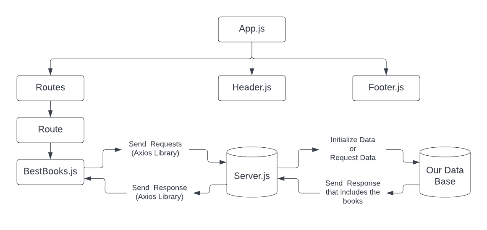

# Project Name

**Author**: Yazan Alfarra, Bashar Nobeh
**Version**: 3.0.0

## Overview

A high end web app that enables you to see the most recommended books to read.

## Getting Started

1. Create Server
2. Create a data base
3. Make the server be able to send request to the data base
4. Createt the front end
5. send request to the server

## Architecture

## Change Log

06-09-2022 1:47pm - Application now has a fully-functional express server and mongo database with route to fetch and post and delete the data and update the data.

05-09-2022 11:42pm - Application now has a fully-functional express server and mongo database with route to fetch and post and delete the data.

04-09-2022 7:54pm - Application now has a fully-functional express server and mongo database with route to fetch the data.
 
## Estimates

Name of feature: server and mongo DB with POST and DELETE requests

Estimate of time needed to complete: 1 hrs

Start time: 12:48pm

Finish time: 1:48pm

Actual time needed to complete: 1 hrs

## Credit and Collaborations

Bashar Nobeh AKA partner, we build the work flow and design the system architecture.
